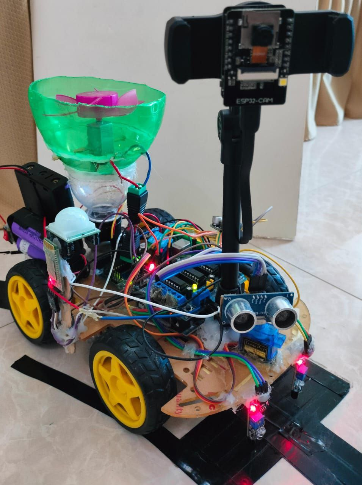
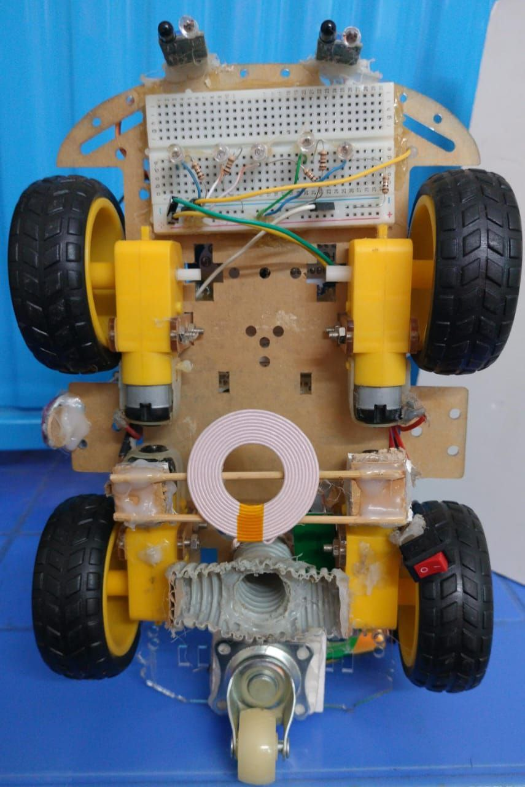
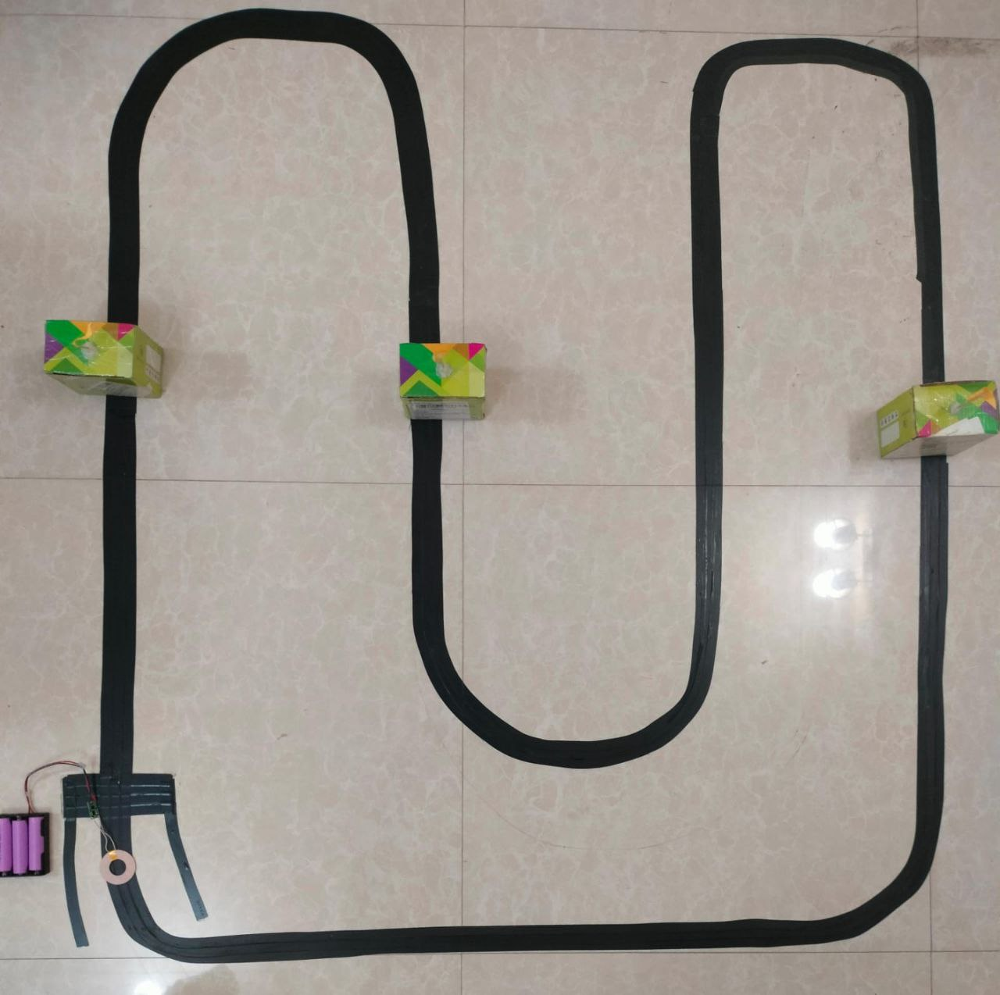
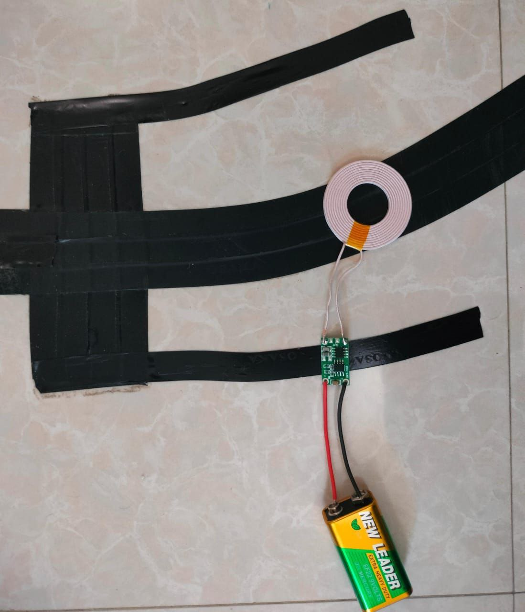
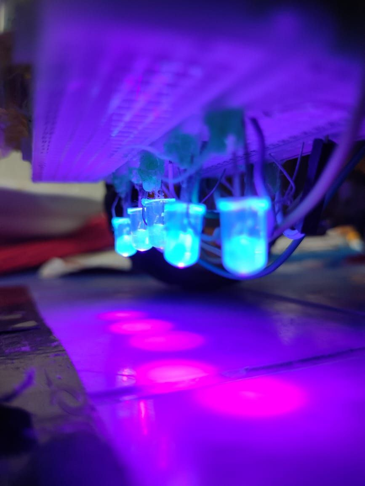
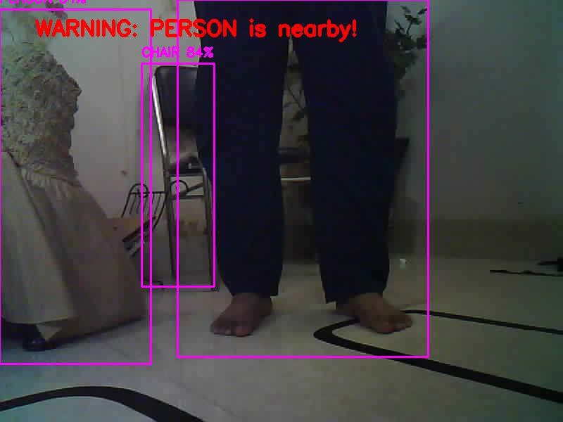
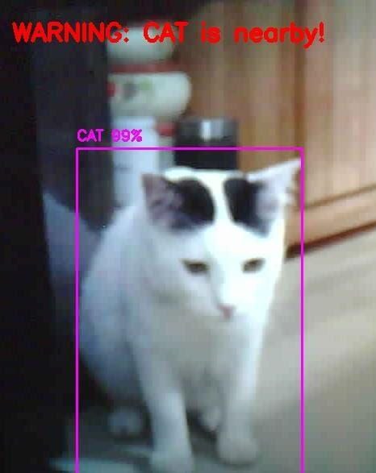

# Surface Disinfecting Robot

## Description

The robot is a cost-effective solution for maximizing surface disinfection using UV light. To prevent harm from UV exposure, it includes sensors that automatically turn off the UV lights when motion is detected. The robot also features AI-based object detection for efficient navigation and surveillance. Additionally, it is equipped with a vacuum cleaner and a wireless charging system.

## Watch Video

[](https://youtu.be/8w68rRsT_-0)

## Screenshots

### Key Features

#### 1. Surface Disinfecting and Cleaning Robot


#### 2. UV Lights And Wireless Charging Receiver Coil


#### 3. Efficient Path Planning


#### 4. Wireless Charging Transmitter Coil


#### 5. Surface Disinfection Using UV Lights


#### 6. AI Based Object Detection (Human)


#### 7. AI Based Object Detection (Other Living beings)


## Installation

1. **Clone the repository**
   ```bash
   git clone https://github.com/yourusername/surface-disinfecting-robot.git
   cd surface-disinfecting-robot
